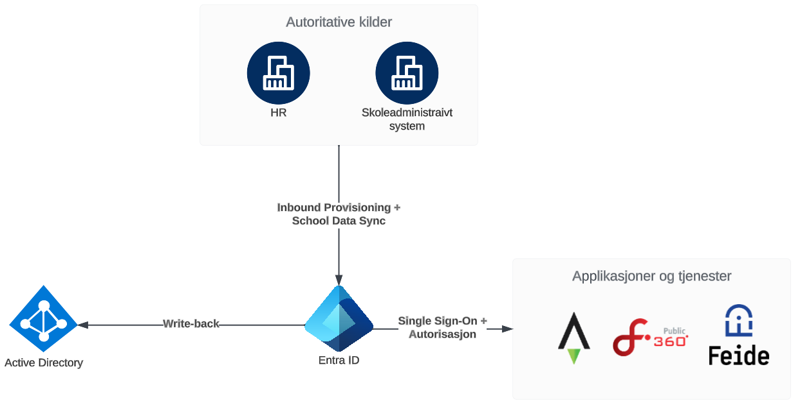

# Integrasjon av tjenester

Designet legger opp til at alle applikasjoner og tjenester integreres mot Entra ID, både for Single Sign-On, Autorisasjon og brukerprovisjonering der det er behov for det. 

!!! info "Brukerprovisjonering?"
    Brukerprovisjonering vil si at IAM-plattformen populerer en brukerdatabase i applikasjonen direkte på forhånd før brukeren logger inn i applikasjonen.

Det er ofte mulig å integrere en applikasjon på flere måter, og for å sørge for at man alltid velger den "beste", er det etablert en del faste integrasjonsmønstre, som alltid skal benyttes, og man velger alltid den første på listen som lar seg benytte:

## Brukerprovisjonering

1. [SCIM-basert integrasjon](./Brukerprovisjonering/1.md)
2. [Populering av applikasjon via API-basert integrasjon](./Brukerprovisjonering/2.md)
3. [Filuttrekk](./Brukerprovisjonering/3.md)
4. [Applikasjon leser selv via Microsoft Graph](./Brukerprovisjonering/4.md)

## Single Sign-On

1. [Multi-tenant app for SaaS applikasjoner](./Single%20Sign-On/1.md)
2. [OpenID Connect integrasjon](./Single%20Sign-On/2.md)
3. [SAML federering](./Single%20Sign-On/3.md)

## Autorisasjon

1. [App-roller og tildelinger](./Autorisasjon/1.md)
2. [Assigned groups as claim](./Autorisasjon/2.md)
3. [SCIM-transferred groups](./Autorisasjon/3.md)
4. [Pipeline transferring app roles to app via API integration](./Autorisasjon/4.md)
5. [Application reading groups from Microsoft Graph](./Autorisasjon/5.md)

