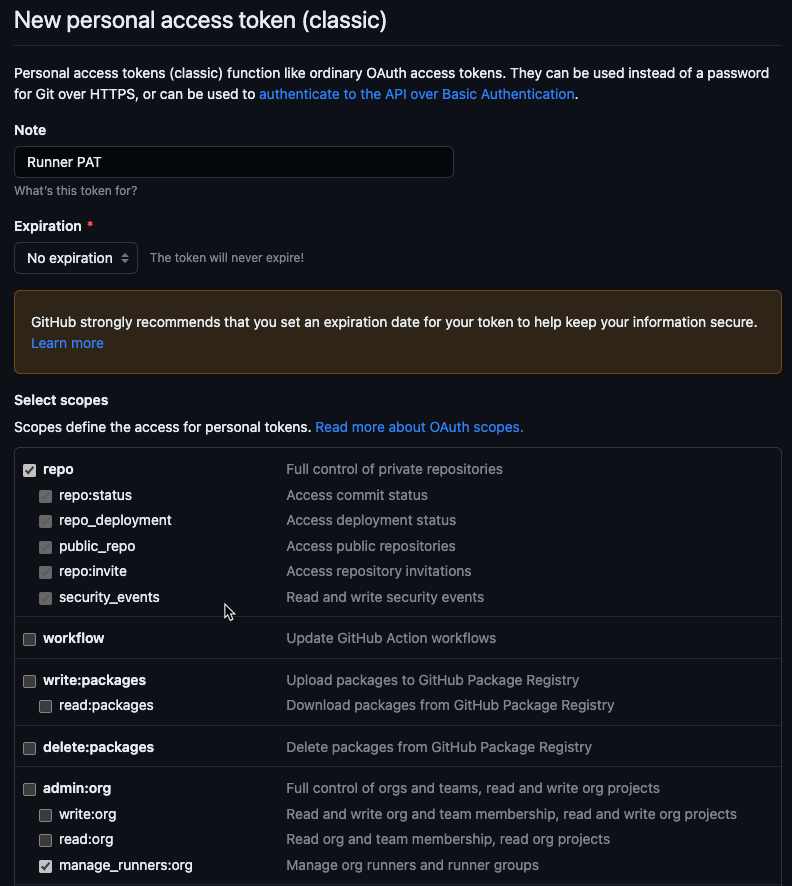
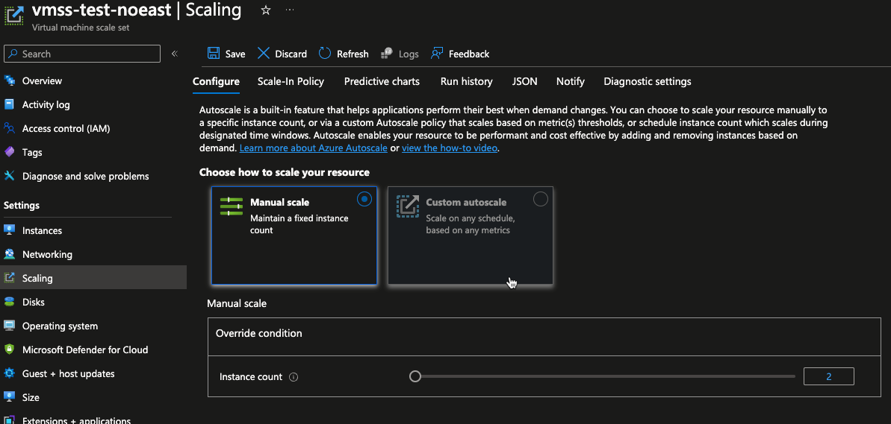
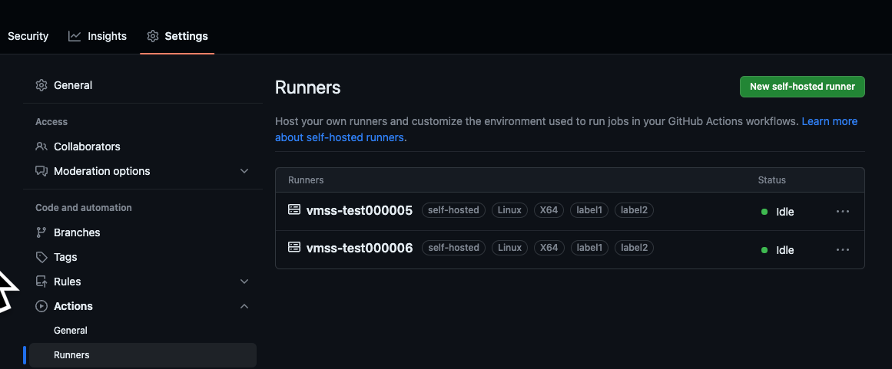

# Step 2 - Configuring the virtual machine scale set for auto registration

Now the the VMSS is up and running, we are ready to configure the Github runner.

## Get a PAT from Github for either repo or organization

If you are registering the runners for a repo, the PAT needs to have access to "repo". If you are registering the runners for an organization, the PAT needs to have access to "manage_runners:org".
To register a PAT, go to "Settings" -> "Developer settings" -> "Personal access tokens" -> "Tokens (classic) and click "Generate new token".



## Configure the VMSS to auto register

Run the following with az-cli to configure an extension on the VMSS that will auto register the runner with Github. Replace the variables with your correct information.

```bash
VMSS=vmss-test-noeast
RG=rg-test-noeast
PAT=ghp_xxx
ORG=mysteq/demo-terraform-vmss-ghrunner
USER=admin42
LABEL=label1,label2
az vmss extension set --vmss-name $VMSS --name customScript --resource-group $RG \
    --version 2.1 --publisher Microsoft.Azure.Extensions \
    --protected-settings "{\"fileUris\": [\"https://raw.githubusercontent.com/amestofortytwo/terraform-azurerm-selfhostedrunnervmss/main/scripts/script.sh\"],\"commandToExecute\": \"sh script.sh $ORG $PAT $USER $LABEL\"}"
```

Scale up the VMSS to at least 1 instance. This can be done in the Azure Portal or with az-cli.



## Verify that the runner is registered

After the previous has been done, you should be able to verify within the organization or the repository that the runner is registered.



[Continue to step 3 - Testing the self hosted runner](./step3.md)