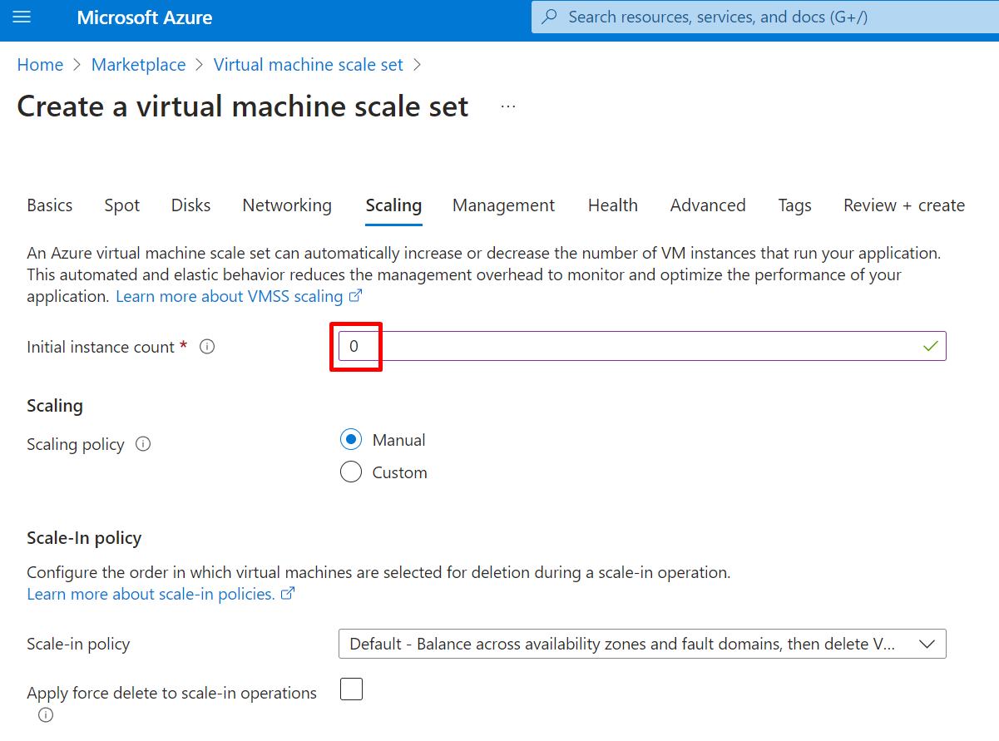
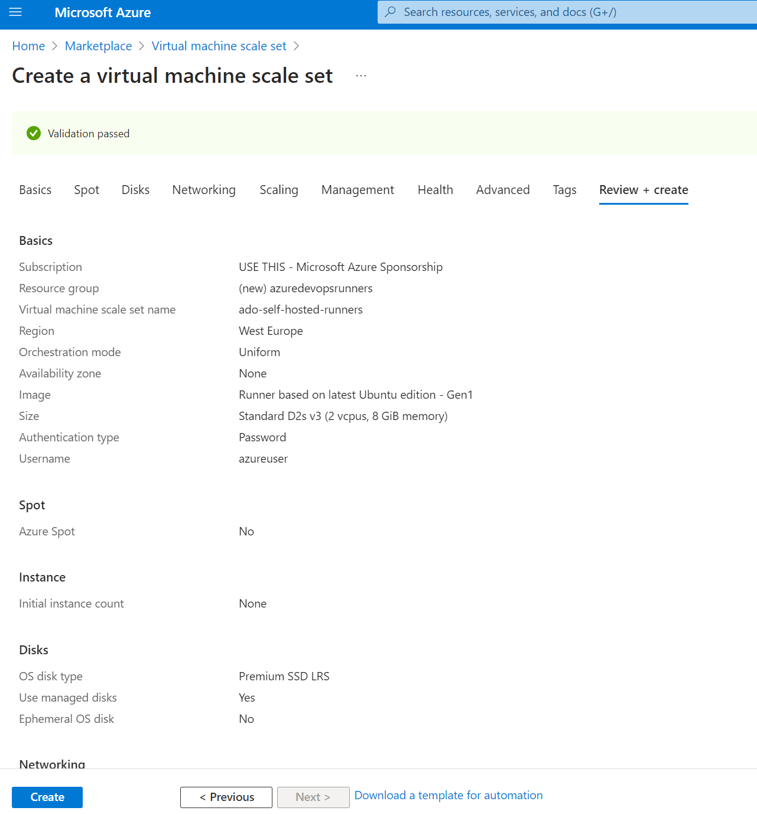

# Configuring GitHub self hosted runners using VMSS

This documentation shows you how to configure an Azure Virtual Machine Scale Set (VMSS) with the latest Self Hosted Runner image, and configuring the VMSS instances to automatically register as self hosted runners in GitHub. Using a VMSS gives you the ability easily increase and decrease the number of active runners whenever you want, manually for now, but it is possible to automate. Additionally, the VMSS will always create instances based on the latest runner image published to the Azure Marketplace, so you will never need to worry about updating the operating system and toolkit - just like the hosted runners!

To configure, you need to follow the three steps below:

1. Configuring the Virtual Machine Scale Set
2. Configuring the VMSS instances to auto-register to GitHub
3. Testing the self hosted runner (Not really required)

## Step 1 - Configuring the Virtual Machine Scale Set

**Note:** If you do not want to handle the creation of the VMSS manually, you can use our [Azure Managed Application](./github-managedapp) instead.

Start by going to the Azure Portal and click **+Create a resource**. 


Search for **Virtual Machine Scale Set**, click on the result and click **Create**


### Basics

- **Project details**
    - **Subscription** - A subscription you have contributor access to
        - **Resource group** - A new or existing resource group
- **Scale set details**
    - **Virtual machine scale set name** - The name of the scale set itself. Cannot be changed after deployment, but everything is stateless, so you can simply deploy a new scale set if needed.
    - **Region** - The region where you want your runners to be located
    - **Availability zone** - Configure to None in order to allow for a cluster with few running instances
- **Orchestration**
    - **Orchestration mode** - Configure to **Uniform**, as we will be running only a single image and runner type
    - **Security type** - Standard is the only supported for our image currently
- **Instance details**
    - **Image** - Locate the Amesto Fortytwo **Self Hosted Runner for GitHub** image and select whether you want an Ubuntu or Windows based runner:

    

    - **Run with Azure Spot discount** - Only select this if you know how to handle spot, and if your pipelines can tolerate evictions
    - **Size** - Choose the virtual machine size you want to run the runners as
- **Administrator account**
    - Configure an administrator account for you virtual machines


### Spot

Skip configuring **Spot** unless you chose to **Run with Azure spot discount**.

### Disks

Leave **Disks** as default and go to the next page.

### Networking

On the **Networking** page, you can choose between creating a new network or reuse an existing one. You can easily connect to a virtual network that is peered into a Azure Landing Zones solution and use private endpoints and stuff. Please be aware that the runners require internet connectivity in order to reach GitHub.

- **Load balancing options** - Choose **None**, as GitHub takes care of this

The default settings will work just fine in most cases:


### Scaling

For scaling, GitHub will take care of everything. However, you should configure **Initial instance count** to **0**, as we need to configure the VMSS for GitHub connectivity before creating our instances.



### Management, Health, Advanced and Tags

No need to configure any of this. Just click next and complete the deployment of VMSS.



### Final configuration

After successfully creating the VMSS instance, click **Go to resource**


Under **Upgrade policy**, switch from manual to **Automatic**.


## Step 2 - Configuring the VMSS instances to auto-register to GitHub

## Step 3 - Example of using the self hosted runners

The following is an example action using the pool we just created:

```yaml

```